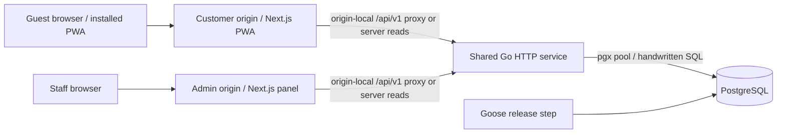

# System architecture

Status: accepted direction; modules not implemented. Decision: [ADR-0001](../decisions/0001-stack.md).

## Boundaries

- `src/pwa`: customer TypeScript/Next.js App Router application with queue tracking, ordering, bill view, and membership. Server Components handle initial reads; client components handle carts and polling. Only this app has a PWA service worker.
- `src/admin`: separate TypeScript/Next.js App Router application for host/server, kitchen, cashier, and manager workspaces. Separate build/deployment and staff sessions; no customer PWA service worker. Go remains authoritative for both frontends; do not duplicate transactions or authorization in Server Actions.
- `src/api`: one Go deployable, standard `net/http` routing, feature modules under `internal/identity`, `queue`, `seating`, `menu`, `ordering`, `billing`, `loyalty`, and `audit`; shared infrastructure under `internal/platform`. Introduce modules when implemented, not empty layers upfront.
- Within a module, handlers decode/authorize, service functions implement use cases/transactions, and repository functions execute parameterized SQL. Keep SQL in module-local `.sql` files embedded with Go; explicit result scanning, no ORM or query builder. Avoid a generic repository framework.
- `src/api/db/migrations`: ordered SQL schema changes managed by Goose. pgxpool handles application connections; the migration role is separate from the application role.
- Cross-module operations such as seating and settlement have one coordinating service and one database transaction. Modules do not make HTTP calls to each other.

## Deployment and runtime

Serve the PWA and admin on separate origins. Each origin routes `/api/v1/*` to the same Go service through trusted HTTPS routing, so browser API calls remain same-origin without broad CORS. Next.js server reads may call Go over an internal URL while forwarding only required cookies/headers. Use host-only cookies with distinct staff and customer session names; do not share a parent-domain session cookie. Go validates allowed origins/CSRF independently of the proxy and never trusts arbitrary forwarded headers. Never expose database credentials through Next.js public environment variables.

The PWA service worker cannot control the admin origin. Both applications use the same HTTP contract, but have separate runtime entrypoints, assets, dependency manifests, and build checks. Requirements, docs, review evidence, and AI tooling stay outside `src/`; see [repository boundaries](repository.md).

Start with one API replica and a bounded pool; document pool size against PostgreSQL connection capacity before adding replicas. Request cancellation propagates to SQL. Set HTTP, statement, and lock timeouts and handle graceful shutdown. No Redis, message broker, or microservices for MVP.

Use HTTP polling initially: foreground guest queue every 10 seconds, staff operational views every 3 seconds, ±20% jitter; pause in hidden tabs and back off on errors. Resume/refetch immediately on focus. Each response includes server time/version; stale data is visibly labeled. No per-guest long-lived database connection. Revisit SSE only after measured need, with an ADR.

Business timestamps are `timestamptz` in UTC; branch business-date/queue numbering uses Asia/Bangkok. Prices use integer satang (`bigint`) and percentage rates use integer basis points. Go validates arithmetic bounds; API monetary integers must remain within JavaScript safe integer limits.

Exact dependency/tool versions are pinned in M0 using then-current supported releases and lockfiles; do not put speculative patch versions in this spec. Use PostgreSQL 18 as the baseline major. Frontend package manager: pnpm. Go modules pin pgx and Goose tool versions; CLI commands in setup must use those pinned versions.

## API evolution

[HTTP contract](../api/http.md) is the initial contract source. Before implementing a slice, encode its routes/schemas in `specs/api/openapi.yaml` (OpenAPI 3.1) and validate it in CI. At that point OpenAPI owns wire schemas; this document and HTTP notes keep rationale/policies only. Generate TypeScript transport types from the contract, not database entities. Do not create a misleading empty OpenAPI contract now.
